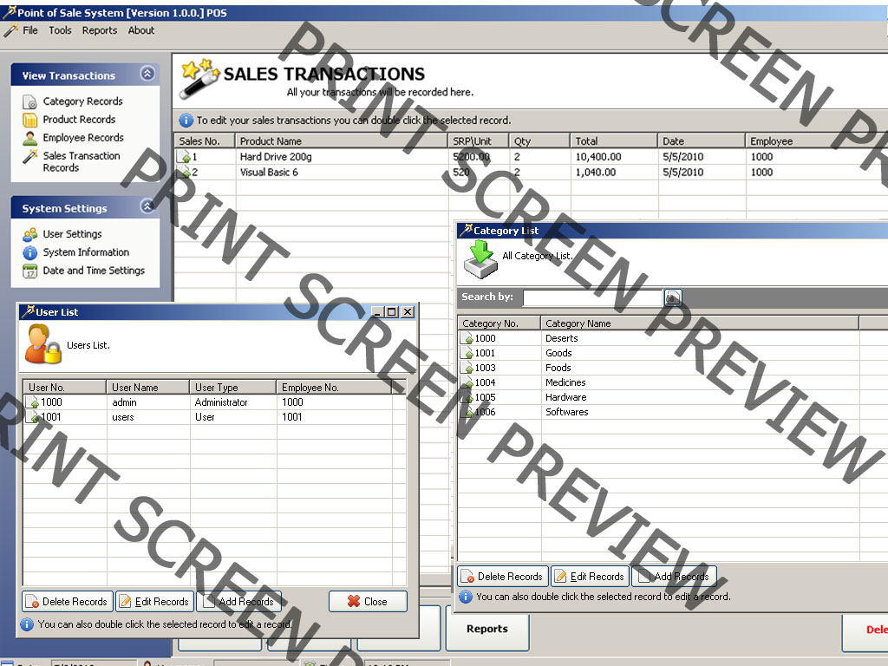



## UPDATED:Point of sale system

### Description

This is a simple POS system

with a role base security system

and a backend of mysql

if you need the ocx you can download it here.Just copy the link

http://www.mediafire.com/?jyngjttyrge
 
### More Info
 

             |
---                |---
**Submitted On**   |2010-06-08 22:24:44
**By**             |[efren II M\. Catedrilla](https://github.com/Planet-Source-Code/PSCIndex/blob/master/ByAuthor/efren-ii-m-catedrilla.md)
**Level**          |Beginner
**User Rating**    |3.0 (12 globes from 4 users)
**Compatibility**  |VB 5\.0, VB 6\.0
**Category**       |[Databases/ Data Access/ DAO/ ADO](https://github.com/Planet-Source-Code/PSCIndex/blob/master/ByCategory/databases-data-access-dao-ado__1-6.md)
**World**          |[Visual Basic](https://github.com/Planet-Source-Code/PSCIndex/blob/master/ByWorld/visual-basic.md)
**Archive File**   |[UPDATED\_Po2182816122010\.zip](https://github.com/Planet-Source-Code/efren-ii-m-catedrilla-updated-point-of-sale-system__1-73179/archive/master.zip)

